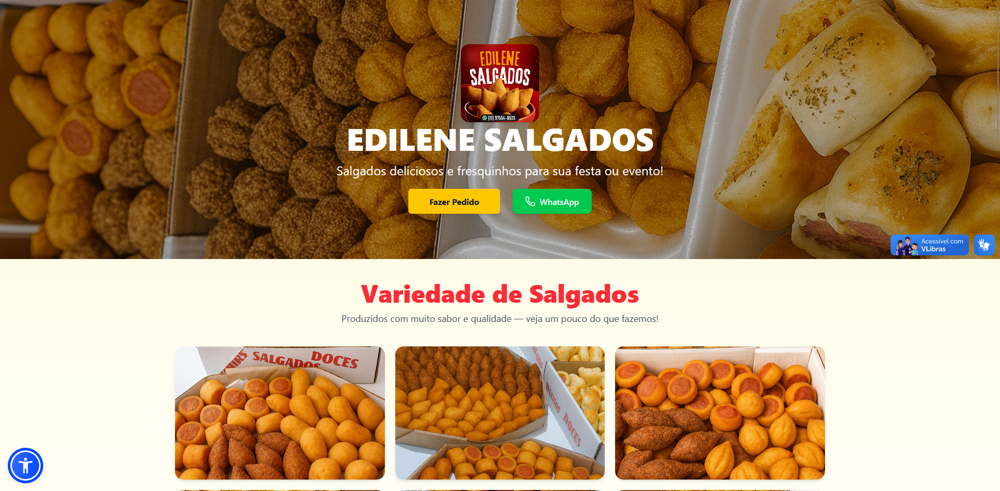

# Projeto UC3: Corre da Quebrada

## Sobre o projeto
Site desenvolvido como parte da **entrega do projeto UC3 — "Corre da Quebrada"**, realizado durante o curso **ProProfissão** do **Instituto PROA**.  

---

## Acesse o site
[**Visite o site da Edilene Salgados**](https://edilene-salgados.vercel.app/)

---

## Tecnologias utilizadas
- **HTML5**
- **CSS3 / TailwindCSS**
- **JavaScript**
- **React + Vite**
- **Vercel** (deploy)

